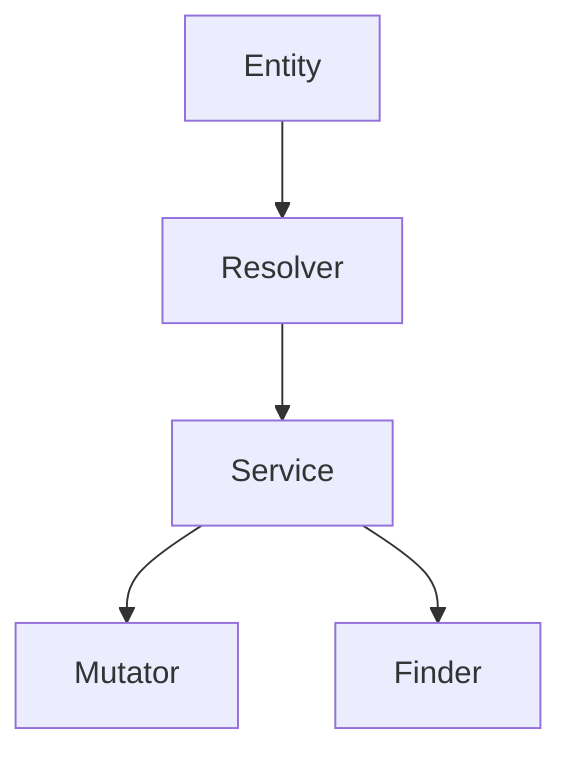
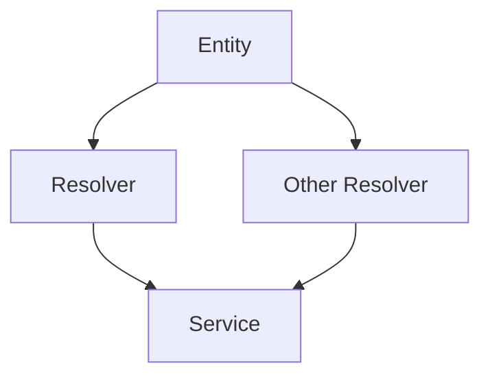

GraphQL can be confusing. This dependency graph helped me visualize the architecture.

```mermaid
graph TB
entity[Entity]
entity --> resolver[Resolver]
resolver --> service[Service]
service --> mutator[Mutator]
service --> finder[Finder]
```

In addition, to create an api object that is a wrapper over an entity.

```mermaid
graph TB
entity[Entity]
entity --> resolver[Resolver]
entity --> secondResolver[Other Resolver]
resolver --> service[Service]
secondResolver --> service
```
